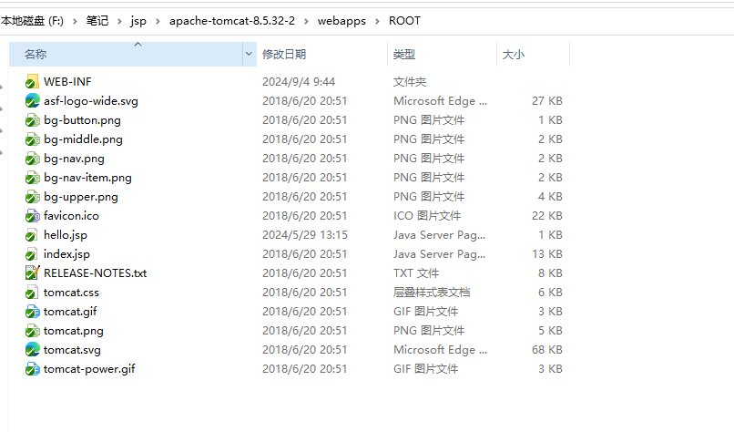
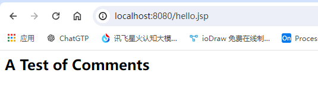
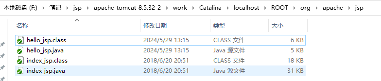

# JSP

参考文档：

Java Web(五) JSP详解(四大作用域九大内置对象等)  https://www.cnblogs.com/whgk/p/6427759.html

## tomcat

> jsp文件在tomcat 的地址 ：apache-tomcat-8.5.32-2\webapps\ROOT

> 启动tomcat后查看hello.jsp

> JSP页面被翻译成Servlet类 （.jsp  -> .java）
>
> 翻译后的Servlet类被编译 	(.java -> .class)

