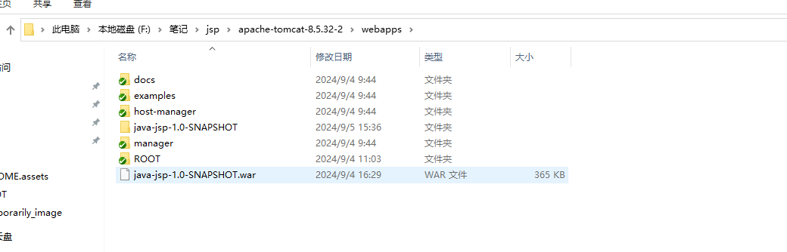
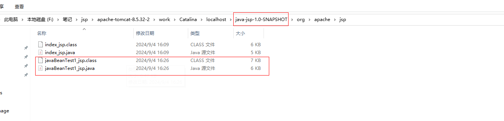

---

---

# JSP

参考文档：

* Java Web(五) JSP详解(四大作用域九大内置对象等)  https://www.cnblogs.com/whgk/p/6427759.html

* JSP详解，看这一篇就够了（含示例） https://blog.csdn.net/2301_79858914/article/details/139302163

## tomcat内查看jsp编译成.java .class

### ROOT目录添加jsp文件

> jsp文件在tomcat 的地址 ：apache-tomcat-8.5.32-2\webapps\ROOT

> 启动tomcat后查看hello.jsp

> JSP页面被翻译成Servlet类 （.jsp  -> .java）
>
> 翻译后的Servlet类被编译 	(.java -> .class)

### ideal打包war包部署webapps目录下

> 启动tomcat后访问：http://localhost:8080/java-jsp-1.0-SNAPSHOT/javaBeanTest1.jsp

> 查看文件夹路径： F:\笔记\jsp\apache-tomcat-8.5.32-2\work\Catalina\localhost\java-jsp-1.0-SNAPSHOT\org\apache\jsp
>
> JSP页面被翻译成Servlet类 （.jsp  -> .java）
>
> 翻译后的Servlet类被编译 	(.java -> .class)

## JSP隐藏的九大内置对象和四大作用域

> page、config、application、request、response、session、out、exception、pageContext

​						page：page对象代表当前JSP页面，**是当前JSP编译后的Servlet类的对象**。相当于this。

　　　　　　config：标识Servlet配置，类型：ServletConfig，api跟Servlet中的ServletConfig对象是一样的，能获取该servlet的一些配置信息，能够获取ServletContext

　　　　　　application：标识web应用上下文，类型：ServletContext，详情就看Servlet中的ServletContext的使用

　　　　　　request:请求对象，　　类型：httpServletRequest

　　　　　　response:响应对象　　类型：httpServletResponse

　　　　　　session：表示一次会话，在服务器端记录用户状信息的技术

　　　　　　**out**：输出响应体 类型：JspWriter

　　　　　　exception 表示发生异常对象，类型 Throwable，在上面我们介绍page指令中的一个errorPage属性时就有说到他

　　　　　　**pageContext**：表示 jsp页面上下文（jsp管理者） 类型：PageContext

　　　　　**out pageContext** 就是JSP独有的，其他的都是Servlet中的老东西。

在这个由jsp转换为servlet的文件中，只能看到8个内置对象，少了exception对象，因为我们在将page指令时，说过一个isErrorPage属性，默认是false，被关闭了，所以其中并没有exception对象。

> JSP的四大作用域：page、request、session、application

　　　　　　 这四大作用域，其实就是其九大内置对象中的四个，为什么说他们也是JSP的四大作用域呢？因为这四个对象都能存储数据，比如request.setAttribute()注意和request.setParameter()区分开来，一个是存储在域中的、一个是请求参数，session.setAttribute()、application其实就是SerlvetContext，自然也有setAttribute()方法。而page作用域的操作就需要依靠pageContext对象来进行了。在上面我们也有提到JSP的四大作用域，

　　　　　　　　page作用域：代表变量只能在当前页面上生效

　　　　　　　　request：代表变量能在一次请求中生效，一次请求可能包含一个页面，也可能包含多个页面，比如页面A请求转发到页面B

　　　　　　　　session：代表变量能在一次会话中生效，基本上就是能在web项目下都有效，session的使用也跟cookie有很大的关系。一般来说，只要浏览器不关闭，cookie就会一直生效，cookie生效，session的使用就不会受到影响。

　　　　　　　　application：代表变量能一个应用下(多个会话)，在服务器下的多个项目之间都能够使用。比如baidu、wenku等共享帐号。

