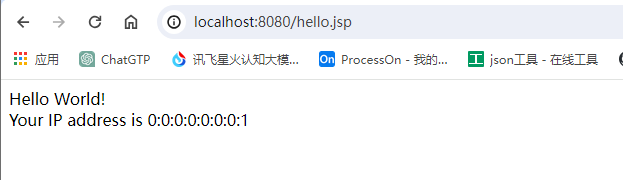
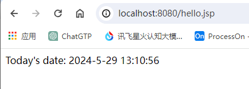
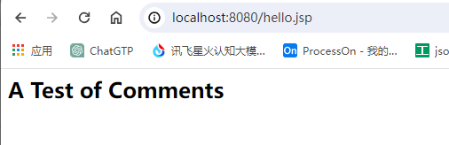

## 脚本程序 <%  %>

``` jsp
<% 代码片段 %>
```

``` jsp
<html>
<head>
<title>Hello World</title>
</head>
<body>
Hello World!<br/>
<% 
out.println("Your IP address is " + request.getRemoteAddr()); 
%>
</body>
</html>
```




## JSP声明 <%!  %>

``` jsp
<%! declaration; [ declaration; ]+ ... %>
```

``` jsp
<%! int i = 0; %> 
<%! int a, b, c; %> 
<%! Circle a = new Circle(2.0); %> 
```


## JSP表达式 <%=  %>

``` jsp
<%= 表达式 %>
```

``` jsp
<html> 
<head>
<title>A Comment Test</title>
</head> 
<body>
<p>   
  Today's date: <%= (new java.util.Date()).toLocaleString()%>
</p>
</body> 
</html> 
```




## JSP注释 <%--  --%>

``` jsp
<%-- 这里可以填写 JSP 注释 --%>
```

``` jsp
<html> 
<head>
<title>A Comment Test</title>
</head> 
<body> 
<h2>A Test of Comments</h2> 
<%-- 该部分注释在网页中不会被显示--%> 
</body> 
</html> 
```




